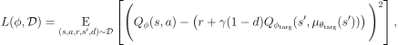
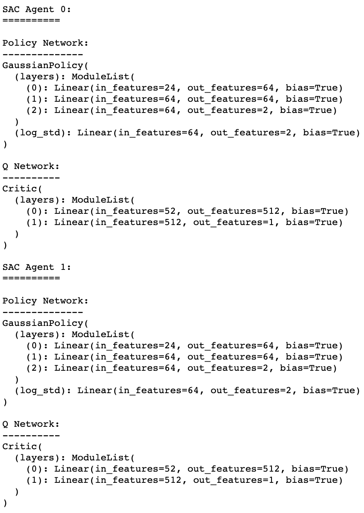

# Report: Tennis environment using Multi-Agent approach

## Learning Algorithm

What we're dealing with here is an envirornment with continuous observation space that consists of 8 variables corresponding to the position and velocity of the ball and racket, and continues action space, a vector with 2 numbers, corresponding to movement toward (or away from) the net, and jumping.

I'll try to solve this environment with three state-of-the-art DRL algorithms, using the latest Actor-Critic methods:

- Deep Deterministic Policy Gradient (a.k.a **DDPG**). [Paper](https://arxiv.org/abs/1509.02971)
- Twin Delayed DDPG or **TD3**. [Paper](https://arxiv.org/abs/1802.09477)
- Soft Actor Critic or **SAC**. [Paper](https://arxiv.org/abs/1801.01290). Improving on this one, there is a [second paper](https://arxiv.org/abs/1812.05905)

### Hyperparameters

Following is a list of all the hyperparameters used and their values:

#### General params
- ```seed = 0```
- ```num_agents = 2```
- ```buffer_size = int(1e6)```
- ```batch_size = 128```
- ```num_episodes = 2000```
- ```log_every = 100```
- ```num_updates = 1```, how many updates we want to perform in one learning step
- ```max_steps = 2000```, max steps done per episode if ```done``` is never ```True```
- ```gamma = 0.99```, discount factor
- ```grad_clip_actor = None```, gradient clipping for actor network
- ```grad_clip_critic = None```, gradient clipping for critic network
- ```use_huber_loss = False```, whether to use huber loss (```True```) or mse loss (```False```)
- ```update_every = 1```, how many steps before updating networks

#### General noise params
- ```use_ou_noise = True```, whether to use OU (```True```) or Gaussian (```False```) noise
- ```expl_noise = 0.1```, exploration noise in case of using Gaussian 
- ```noise_weight = 1.0```
- ```decay_noise = False```
- ```noise_linear_decay = 1e-6```
- ```noise_decay = 0.99```
- ```use_linear_decay = False```, noise_weight - noise_linear_decay (```True```), noise_weight * noise_decay (```False```)

#### Ornstein–Uhlenbeck params
- ```ou_mu = 0.0```
- ```ou_theta = 0.15```
- ```ou_sigma = 0.2```

When we reach env_solved avarage score (our target score for this environment), we'll run a full evaluation, that means, we're gonna evaluate times_solved times (this is required to solve the env) and avarage all the rewards:
- ```env_solved = 0.5```
- ```times_solved = 100```

#### DDPG params
- ```tau = 1e-2```, used in polyak averaging (soft update)
- ```lr_actor = 1e-3```
- ```lr_critic = 1e-3```
- ```hidden_actor = (64, 64)```
- ```hidden_critic = (512,)```
- ```activ_actor = F.relu```
- ```activ_critic = F.relu```
- ```optim_actor = Adam```
- ```optim_critic = Adam```

#### TD3 params
- ```tau = 1e-2```,
- ```lr_actor = 1e-3```
- ```lr_critic = 1e-3```
- ```hidden_actor = (64, 64)```
- ```hidden_critic = (256, 256)```
- ```activ_actor = F.relu```
- ```activ_critic = F.relu```
- ```optim_actor = Adam```
- ```optim_critic = Adam```
- ```policy_noise = 0.1```, target policy smoothing by adding noise to the target action
- ```noise_clip = 0.1```, clipping value for the noise added to the target action
- ```policy_freq_update = 2```, how many critic net updates before updating the actor

#### SAC params
- ```tau = 1e-2```,
- ```lr_actor = 1e-3```
- ```lr_critic = 1e-3```
- ```hidden_actor = (64, 64)```
- ```hidden_critic = (512,)```
- ```activ_actor = F.relu```
- ```activ_critic = F.relu```
- ```optim_actor = Adam```
- ```optim_critic = Adam```
- ```log_std_min=-20```, min value of the log std calculated by the Gaussian policy
- ```log_std_max=2```, max value of the log std calculated by the Gaussian policy
- ```alpha = 0.01```,
- ```alpha_auto_tuning = True```, when ```True```, ```alpha``` is a learnable
- ```optim_alpha = Adam```, optimizer for alpha
- ```lr_alpha = 3e-4```, learning rate for alpha

### Algorithms

**Multi Agent architecture**:

Training a Multi Agent system is definitely more complex than training a single agent. We can take two extreme approaches to train the agents in such system, and we'll discover where this complexity lies:

1. We could train all the agents independently, without coonsidering the existence of the other agents, which then will become part of the environment. As all the agents learn at the same time, this means their policies will evolve independently from one another, then the environment, as seen from the perspective of a single agent, will change dynamically and therefore becomes non-stationary. Non-stationary environments cannot guarantee convergence during learning.

2. Second approach could be the completely opposite of the first one. This is called the meta-agent approach. Here a single policy is learnt for all the agents, taking the state of the environment and returning a vector with the action for all the agents. The environment in this case would return a single global reward. This joined action space will increase exponentially with the number of agents. If the environment is partially observable or the agents can see only locally, each agent will have a different observation of the environment state. This makes it difficult to disambiguate the state of the environment from different local observations. So this approach only works well when each agent knows everything about the enviornment, which is not always the case.

There are many interesting papers out there on MARL. One of them is called [Multi Agent Actor Critic for Mixed Cooperative Competitive environments](https://papers.nips.cc/paper/7217-multi-agent-actor-critic-for-mixed-cooperative-competitive-environments.pdf). This is the approach I'm implementing here for a collaborative setup, but it can be also used for competitive or a mixed scenario. Here is how it works: the idea to use a centralized training with a decentralized execution. The way we do this is to allow the critic access to all the agents' states observed and actions taken during training. As for the actor, each one has only access to its agent's state and actions. During execution time, only the actors are present and will be using their agents' states to return their actions. A learning critic for all the agents allows us to use a different reward structure for each agent. Here we have an qverview of our multi-agent decentralized actor, centralized critic approach:

<p align="center"></p>

**Deep Deterministic Policy Gradient or DDPG**:

DDPG is an off-policy algorithm considered to be the Q-learning version for continuos action space. It uses four neural nets: a Q-network, a (deterministic) policy network and their respective target networks. The Q-function is used to learn the policy, and it does so by using off policy data and the Bellman equation. Remember, in Q-learning if we know the optimal ```Q(s,a)```, finding the optimal action in a given state is as simple as solving:

<p align="center"></p>

Finding  when the action space is continous is not trivial. But because of this continuity in the action space, we assume that the optimal ```Q(s,a)``` is differentiable with respect to action. This makes it possible to use a gradient based learning rule for ```μ(s)``` and instead approximate it:


<p align="center"></p>

DDPG uses two tricks to make the learning more stable:

1. _Replay Buffer_: since DDPG is an off policy algorithm, it can make use of a replay buffer to store previous experiences to later on sample random and uncorrelated mini batches to learn from.

2. _Target Networks_: these networks will be a time-delayed copies of the original ones that slowly track the learned networks. They prevent the "chasing a moving target" effect when using the same parameters (weights) for estimating the target and the Q value. This is because there is a big correlation between the TD target and the parameters we are changing. These target networks are [softly updated](https://github.com/jscriptcoder/Multi-Agent-Collaboration-and-Competition/blob/master/agent/utils.py#L17) by polyak averaging: 

The Q-Network is updated by minimizing the mean squared Bellman equation as followed:

<p align="center"></p>

where ```(s,r,a,s',d)~D``` are random mini batches of transitions, and ```d``` indicates whether state ```s'``` is terminal.

For the policy function, our objective is to maximize the expected return, so we want to learn a ```μ(s)``` that maximizes ```Q(s,a)```. Now, remember that our action space is continuous, so we're assuming that the Q-function is differentiable with respect to action, we can then simply perform gradient ascent with respect to policy parameters to solve:

<p align="center"></p>

One more detail about this algorithm is how to go about exploration for continuous action space. When dealing with discrete action spaces, exploration is done by selecting a random action using, for example, epsilon-greedy algorithm or Boltzmann exploration. There is an [interesting article](https://medium.com/emergent-future/simple-reinforcement-learning-with-tensorflow-part-7-action-selection-strategies-for-exploration-d3a97b7cceaf) explaining these two strategies for action selection. For continuous action spaces instead, we can simply add noise to the actions. The authors of the original DDPG paper recommended time-correlated [OU noise](https://en.wikipedia.org/wiki/Ornstein%E2%80%93Uhlenbeck_process), but more recent results suggest that uncorrelated, mean-zero Gaussian noise works perfectly well, and this is actually the strategy I'm using for exploration. Another strategy that seems to work better is to use parameter noise. Parameter noise adds adaptive noise to the parameters of the neural network policy, rather than to its action space, helping the algorithm explore its environments more effectively. If you wanna know more about this technique, refer to [this article](https://openai.com/blog/better-exploration-with-parameter-noise/) from OpenAI.


Sources: [OpenAI, Spinning up, Deep Deterministic Policy Gradient](https://spinningup.openai.com/en/latest/algorithms/ddpg.html), [Deep Deterministic Policy Gradients Explained](https://towardsdatascience.com/deep-deterministic-policy-gradients-explained-2d94655a9b7b)

**Twin Delayed DDPG or TD3**:

TD3 is the succesor of DDPG algorithm, and therefore is an off-policy algorithm. Even though DDPG is capable to providing excellent results for continuous action spaces, it also has its drawbacks. It's quite sensitive to hyperparameters and other kind of tuning. A common failure in DDPG is that its Q-function tends to overstimate the Q-values, which can make the agent fall into local optimal or experience catastrophic forgetting. TD3 addresses these issues with three interesting tricks:

1. _Clipped Double-Q Learning_: This is inspired by [Deep Reinforcement Learning with Double Q-learning](https://arxiv.org/abs/1509.06461). The idea is to use two Q-networks and use the smallest of the two as the Q-values to form the targets in the Bellman error loss functions, helping fend off overestimation in the Q-function:

<p align="center">
  <br />
  <br />
  
</p>

2. _Delayed updates of the actor_: Actor-Critic methods have some issues when using target networks. This is caused by the interaction between the policy (actor) and value (critic). The training of the agent diverges when a poor policy is overestimated. Our agent's policy will then continue to get worse as it is updating on states with a lot of error. The idea is to update the policy network (and its target) less frequently than the value network, which makes it more stable and reduce errors before it is used to update the policy network.

3. _Action noise regularisation_: Adding noise to the target action makes it harder for the policy to exploit Q-function errors by smoothing out Q along changes in action. Deterministic policy methods have a tendency to produce target values with high variance when updating the critic. This noise added to the target and avaraging over mini batches has the effect of reducing this variance. The range of noise is clipped in order to keep the target value close to the original action:

<p align="center"></p>

Finally, the policy is learned by maximizing ```Q1```: 

Same strategy as DDPG is followed for exploration in continuous action space.


Sources: [OpenAI, Spinning up, Twin Delayed DDPG](https://spinningup.openai.com/en/latest/algorithms/td3.html), [TD3: Learning To Run With AI](https://towardsdatascience.com/td3-learning-to-run-with-ai-40dfc512f93)

**Soft Actor Critic or SAC**:

What we have here is another off-policy algorithm. It could be considered to be the bridge between stochastic policy optimization and DDPG-style approaches, learning such stochastic policies, like in A2C and PPO, in an off-policy way like DDPG and TD3. 

The main feature of SAC is entropy regularization: instead of just trying to maximize the expected return, it also tries to maximize the policy entropy. We can think of entropy as how unpredictable a random variable is. If a random variable always takes a single value then it has zero entropy because it's not unpredictable at all. If a random variable can be any Real Number with equal probability then it has very high entropy as it is very unpredictable. This helps with exploration. Increasing entropy results in more exploration, which can accelerate learning later on. It can also prevent the policy from prematurely converging to a bad local optimum. The entropy ```H``` is computed as followed: , being ```x``` a random variable from ```P``` distribution. The agent gets a bonus reward at each time step proportional to the entropy of the policy at that timestep:

<p align="center"></p>

where ```α > 0``` is the trade-off coefficient, also called temperature, which determines the relative importance of the entropy term versus the reward, and thus controls the stochasticity of the optimal policy. Unfortunately, choosing the optimal temperature is non-trivial, and a sub-optimal temperature can drastically degrade performance of the learning. To solve this problem, in recent researches, extension of SAC, this temperature is automatically adjusted, using automatic gradient-based methods, to the expected entropy over the visited states to match a target value:

<p align="center"></p>

Another important aspect of SAC is the fact that it also incorporates the clipped double-Q trick as in TD3 to avoid overestimation of Q-values. The two Q-networks' parameters can be optimized with stochastic gradients:

<p align="center"></p>

TODO
---
Something important to mention about this algorithm is Enforcing Action Bounds ([Appendix C](https://arxiv.org/pdf/1812.05905.pdf)). We use an unbounded gaussian as the action distribution. However, in practice, the actions needs to be bounded to a finite interval. We apply then an invertible squashing function, Tanh, to the gaussian samples, and employ the change of variables formula to compute the likelihoods of the bounded actions. In the other words, let u ∈ R
D be a random variable and µ(u|s) the corresponding
density with infinite support. Then a = tanh(u), where tanh is applied elementwise, is a random
variable with support in (−1, 1) with a density given by

---


Sources: [OpenAI, Spinning up, Soft Actor-Critic](https://spinningup.openai.com/en/latest/algorithms/sac.html), [Soft Actor-Critic Demystified](https://towardsdatascience.com/soft-actor-critic-demystified-b8427df61665)

### Neural Networks Architecture

In all the networks I'm using [ReLU](https://machinelearningmastery.com/rectified-linear-activation-function-for-deep-learning-neural-networks/) activation function, and also [Adam](https://machinelearningmastery.com/adam-optimization-algorithm-for-deep-learning/) optimizer as a gradient descent algorithm.

**About Actor Network**: The goal of this network is to map state => actions, ```μ(s)```. In the forward pass, the last layer is [passed through](https://github.com/jscriptcoder/Multi-Agent-Collaboration-and-Competition/blob/master/agent/actor.py#L25) a Tanh activation to get values between -1 and 1, which is the range of the actions

**About Critic Network**: The goal of this network is to map state and action => value, ```Q(s,a)```. It'll take the state and actions as inputs, concatenate them, and pass them through the layers. The last layer or output is one single value without activation function.

1. **DDPG**:


2. **TD3**:


3. **SAC**:



**About Gaussian Network**: The goal of this network is to map state => μ (mean), σ (standard deviation). With this output we can sample actions from the normal (gaussian) distribution, ```Normal(mean, std)```. The policy will learn the log std instead. This is because log stds are free to take on any values in (-inf, inf), while stds must be non-negative. It's easier to train parameters if you don't have to enforce those kinds of constraints. The std can be obtained immediately from the log std by exponentiating them. [Source](https://spinningup.openai.com/en/latest/spinningup/rl_intro.html#stochastic-policies)... It's also important to mention that the log std depends on the state, that means, it'll be learned based on the state. For this algorithm a state-independent log std seems to not work well.

## Plot of Rewards

1. **DDPG**:


As seen in the [jupyter notebook](Tennis.ipynb), the environment was solved, 100 times consecutively, with an avarage score of 0.9 (and a max score of 2.6), after 918 episodes and 0:15:53 running on CPU.

2. **TD3**:


The environment was solved with an avarage score of 2.1 (and a max score of 2.7), after 1716 episodes and 0:42:42 running on CPU.

3. **SAC**:


The environment was solved with an avarage score of 1.7 (and a max score of 2.6), after 1570 episodes and 0:41:21 running on CPU.

## Ideas for Future Work

I was expecting better performance in TD3 and SAC, since these algoritms are improvements and the results of more recent research than DDPG. Hyperparameter tuning plays an important role in Deep Reinforcement Learning, and varies across environments and algos. I'm convinced that a more thorough hyperparameter search would give me better performanfe than DDPG for the other algorithms, but I didn't spend much time on this aspect, so that would be an area of future research.

Another aspect worth to investigate would be to not perform early stop, that is, not to stop the learning right after reaching the target score 100 times consecutively, but instead leave the training go for a fixed amount of episodes, let's say 10k or 20k, and see how the the policies evolve. Probably there we could see that TD3 and SAC evolve more efficiently than DDPG eventually coming up with better policies.

The last interesting idea would be to modify the multi-agent architecture to allow different types of algorithms for the two agents, let's say agent 1 uses SAC and agent 2 uses DDPG. Then change the reward function to turn it into a competition, let them play and watch the two agents trying to beat each other 😉.
